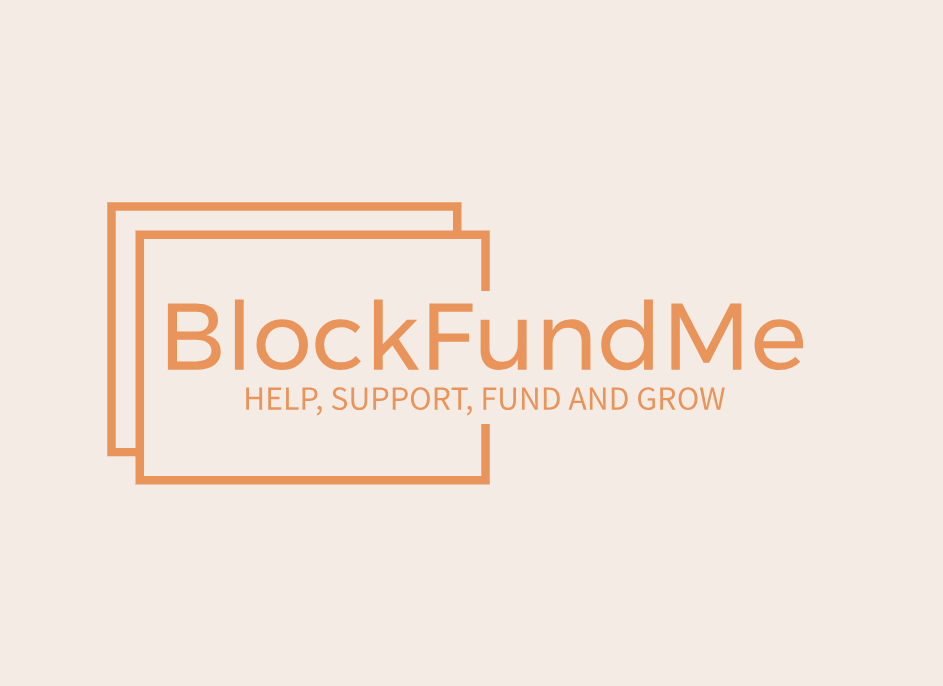
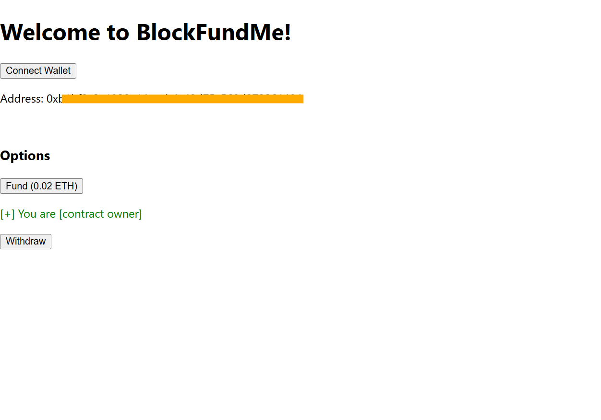

# BlockFundMe



## Description

**BlockFundMe** is a blockchain-powered decentralized application (dApp) that functions similarly to GoFundMe, but leverages Web3 technology. This platform enables users to contribute funds towards a shared goal, where only the contract owner can withdraw the raised funds. Non-owner users can participate by making funding calls to the contract, but the control over the withdrawal is trustlessly handled by the smart contract itself.

The **trustless nature** of the blockchain and the underlying smart contract ensures that the platform is immune to fraud, data manipulation, or interference by any centralized authority or third-party intermediary. This makes the entire process more secure and transparent, empowering individuals to fund causes directly without relying on intermediaries.

## Features

- **Decentralized Funding:** Anyone (except the contract owner) can make contributions to the contract's funding pool.
- **Owner-Only Withdrawals:** Only the contract owner has the permission to withdraw the funds once the goal is met.
- **Security & Transparency:** Blockchain and smart contract technologies ensure that funds are secure and that all transactions are recorded on-chain.



## Notes

This project will continue to evolve over time. I will be updating both the front-end and the underlying smart contract to introduce more features, enhancements, and security improvements. Keep an eye out for new functionality as the project grows.

## Installation

To run **BlockFundMe** locally, follow these steps:

1. Clone the repository:
   ```bash
   git clone https://github.com/yourusername/blockfundme.git
   ```
2. Install the dependencies:
   ```bash
   cd blockfundme
   npm install
   ```
3. Run the application:
   ```
   npm start
   ```
   Make sure to have **MetaMask** installed for wallet interactions.

## Contributing

Feel free to fork the repository and submit pull requests. All contributions are welcome! Check out the [issues](https://github.com/ianwright27/blockfundme/issues) to see if there's anything you'd like to work on.
